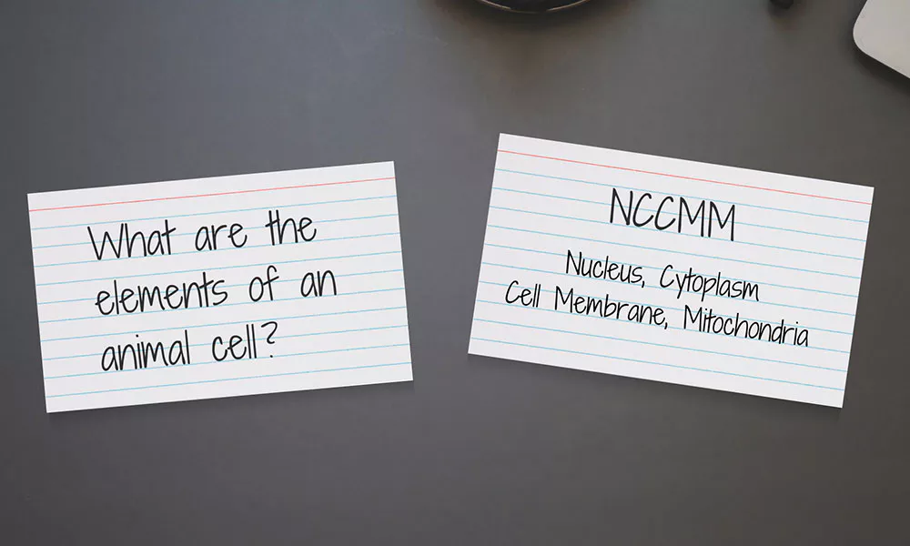
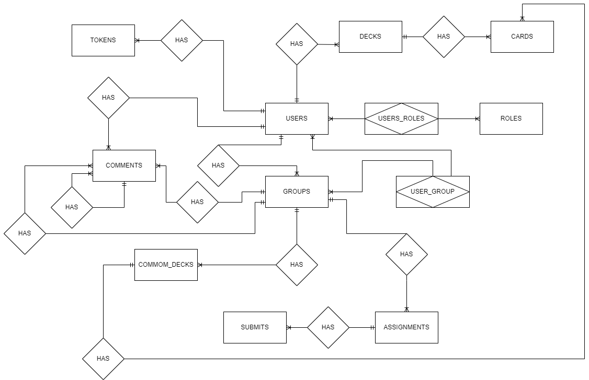

# online learning (ReactJS, React Router)

# Table of Contents
- [LÝ DO CHỌN ĐỀ TÀI](#0)
- [HƯỚNG DẪN CHẠY ĐỒ ÁN](#1)
- [DATABASE](#database)
- [TÍNH NĂNG WEBAPP](#2)
- [CÔNG NGHỆ SỬ DỤNG](#3)
- [GIAO DIỆN](#4)
- [FILE BÁO CÁO](#5)

## LÝ DO CHỌN ĐỀ TÀI 
**Cơ chế học tập flashcard**

**Khái niệm flashcard:**

Mỗi flashcard thường có một câu hỏi hoặc một từ ở một mặt và câu trả lời hoặc định nghĩa ở mặt kia.

**Cách sử dụng:**
- Nhìn Mặt Trước: Đọc câu hỏi hoặc từ ở mặt trước của flashcard.
- Trả Lời: Tự trả lời câu hỏi hoặc định nghĩa từ.
- Kiểm Tra Mặt Sau: Xem câu trả lời hoặc định nghĩa ở mặt sau của flashcard.

**Định hướng**
- Tạo sự tương tác, kết nối cộng động học tập với bộ thẻ cá nhân, sao chép bộ thẻ, cùng nhau xây dựng bộ thẻ (học phần)
- Cá nhân hóa quát trình học tập
- Linh hoạt thời gian và địa điểm
## HƯỚNG DẪN CHẠY ĐỒ ÁN 
**RESTful API online learning**
- Webapp nhận json từ REST API **online learning backend**: **https://github.com/hdnguyen02/tttn-online-learning-spring**

**Clone đồ án**
- Điều hướng cmd hoặc terminal đến folder đã clone đồ án sau đó chạy lệnh để cài đặt dependencies: **npm install**
- Điều hướng cmd hoặc terminal đến folder đã clone đồ án sau đó chạy lệnh để run đồ án: **npm run dev**

## DATABASE 

**ERD**

Sơ đồ quan hệ thực thể

**Mô hình dữ liệu**

## TÍNH NĂNG WEBAPP 
**Học sinh**
- Đăng nhập/đăng ký
- Quên mật khẩu
- CRUD bộ thẻ, thẻ
- Tìm kiếm, lọc bộ thẻ, thẻ
- Sao chép bộ thẻ từ người dùng khác
- Học thẻ
- Xây dựng học phần (bộ thẻ của lớp) trong lớp học
- Nộp bài tập trong lớp học
- Thảo luận trong lớp học
- Hiệu chỉnh thông tin cá nhân

**Giáo viên (kế thừa học sinh)**
- CRUD lớp học
- CRUD học phần (bộ thẻ của lớp)
- CRUD bài tập
- Mời học sinh vào lớp thông qua email

## CÔNG NGHỆ SỬ DỤNG 
- **Javascript, HTML, CSS, Tailwind**
- **ReactJS, React Router, React Toastify, React Modal**
- Vite
## GIAO DIỆN 

- **Trang chủ khi chưa đăng nhập**

- **Đăng nhập**

- **Đăng ký**

- **Trang chủ sau khi đăng nhập**

- **Liên hệ**

- **Bộ thẻ cá nhân của người dùng**

- **Tạo bộ thẻ cá nhân**

- **Hiệu chỉnh bộ thẻ cá nhân**

- **Thẻ cá nhân**

- **Học thẻ**

Nhấn vào thẻ để lật thẻ

- **Bộ thẻ chuyên gia**
Bộ thẻ được public bởi các chuyên gia, người dùng có thể sao chép bộ thẻ về tài khoản của mình, sau đó có thể tiến hành hiệu chỉnh, thêm mới hoặc xóa thẻ không cần thiết

- **Lớp học chuyên gia**
Lớp học được public, mọi người dùng có thể thấy được lớp học và tham gia

- **Chi tiết lớp học chuyên gia**

- **Lớp học cá nhân**

Lớp học do bạn làm chủ (giáo viên)

Lớp học bạn tham gia (học sinh)

- **Thao tác ở lớp học do bạn làm chủ**

tạo lớp (giáo viên)

Hiệu chỉnh lớp (giáo viên)

Chi tiết lớp học (giáo viên)

- Với các tab 

Member: Danh sách học sinh và thao tác lên học sinh 

Danh sách học sinh

Mời học sinh

Common card set (học phần)

Danh sách học phần

Tạo học phần

Hiệu chỉnh học phần

Chi tiết học phần

Tạo thẻ trong chi tiết học phần

Hiệu chỉnh thẻ trong chi tiết học phần

Xóa thẻ trong chi tiết học phần

Học thẻ trong chi tiết học phần

Comment (thảo luận)

Assignment (bài tập)

Danh sách bài tập

Chi tiết bài tập

Chi tiết nộp bài tập

